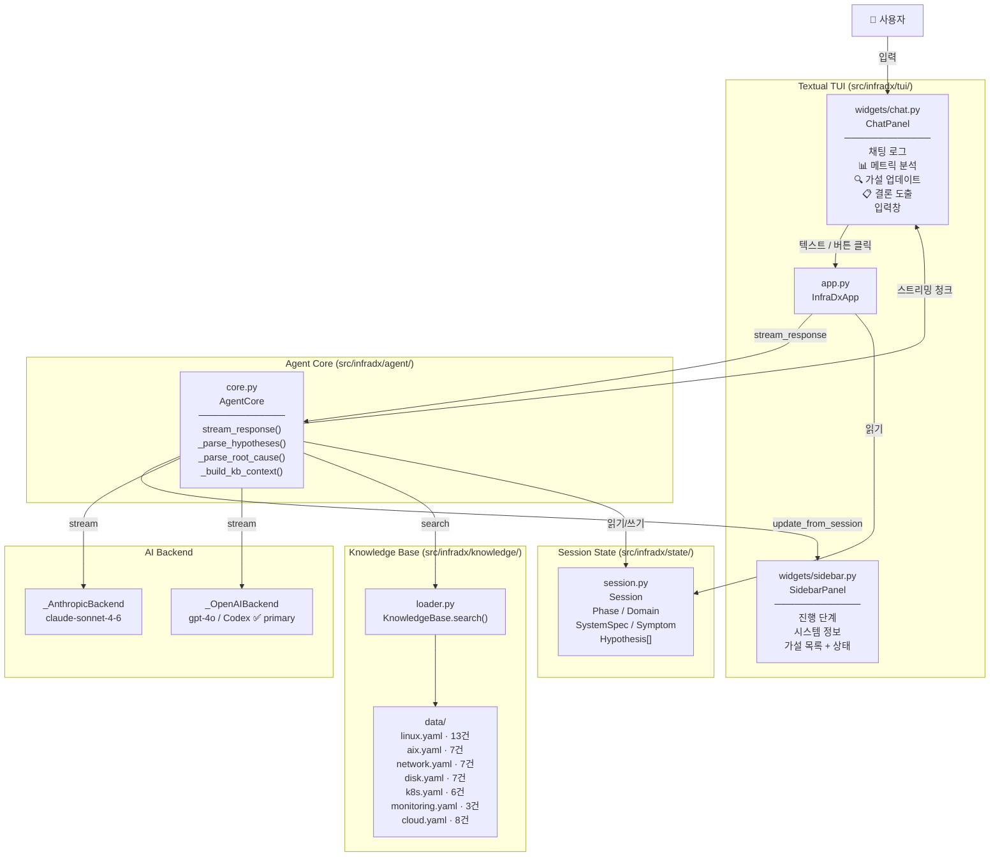
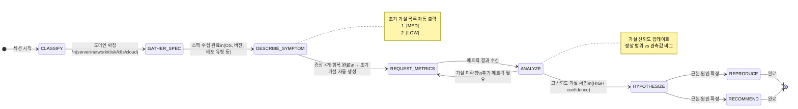
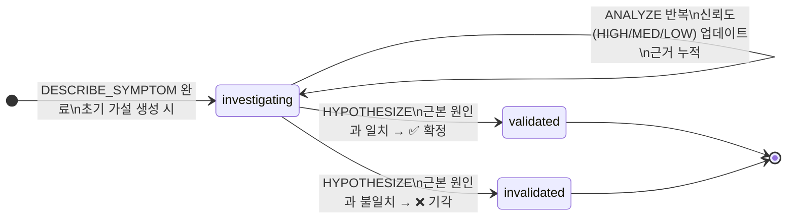
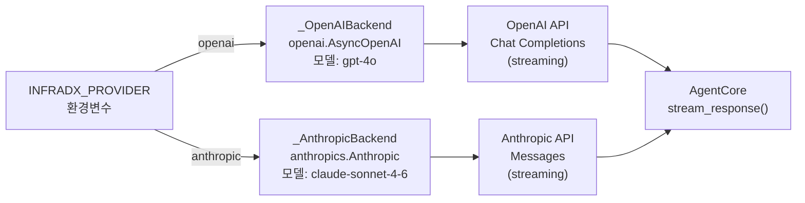
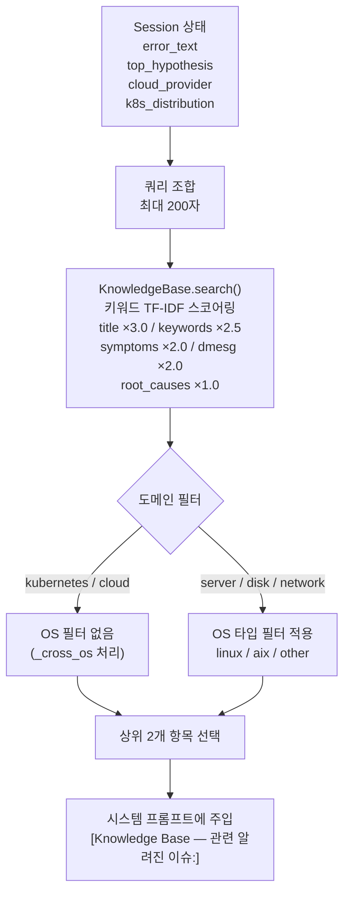

# InfraDx — Architecture

## 시스템 아키텍처



---

## Phase 상태머신



---

## 가설 Lifecycle



---

## 멀티 백엔드 구조



---

## 지식베이스 검색 흐름



---

## 디렉터리 구조

```
infradx/
├── AGENT.md                    # 메인 에이전트 시스템 프롬프트 (8단계 상태머신)
├── CLAUDE.md                   # Claude Code 프로젝트 컨텍스트
├── codex/
│   └── agent_instructions.md  # OpenAI Codex / GPT-4 호환 지침 (Function Calling)
├── skills/                     # 단계별 스킬 파일 (AgentCore가 시스템 프롬프트에 병합)
│   ├── classify.md
│   ├── gather-context.md
│   ├── request-metrics.md
│   ├── analyze.md
│   ├── hypothesize.md
│   ├── reproduce.md
│   └── recommend.md
├── docs/
│   └── architecture.md        # 이 파일 — Mermaid 아키텍처 다이어그램
├── src/infradx/
│   ├── __main__.py             # 진입점 (.env 로드 → InfraDxApp 실행)
│   ├── agent/
│   │   └── core.py             # AgentCore: 스트리밍, KB 주입, 가설 파싱
│   ├── state/
│   │   └── session.py          # Phase · Session · Hypothesis · SystemSpec
│   ├── knowledge/
│   │   ├── loader.py           # KnowledgeBase: YAML 로드 + 키워드 검색
│   │   └── data/               # 도메인별 Known Issue DB (총 51개)
│   └── tui/
│       ├── app.py              # Textual 앱: 버튼 핸들러, Ctrl+C/N/S/Q
│       └── widgets/
│           ├── chat.py         # 대화 패널 + 액션 버튼 3개
│           └── sidebar.py      # 진행 단계 + 시스템 정보 + 가설 상태 배지
├── .env.example
└── pyproject.toml
```
